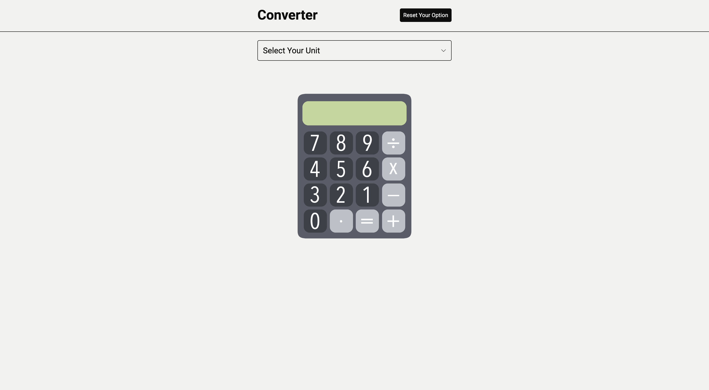

# React Converter App

> 노마드 코더 React JS 강의를 참고하여 단위변환 앱을 리액트로 만들기 ([참고강의 : 노마드 코더, ReactJS로 영화 웹 서비스 만들기](https://nomadcoders.co/react-for-beginners) )

## 📆 제작기간

2025.03.26 ~ 2025.03.26 (1일)

## ⚙️ 사용 언어

React JS

## 프로젝트 목표

- React에서의 요소 생성에 대한 이해
- useState에 대한 이해
- JSX 문법 숙련
